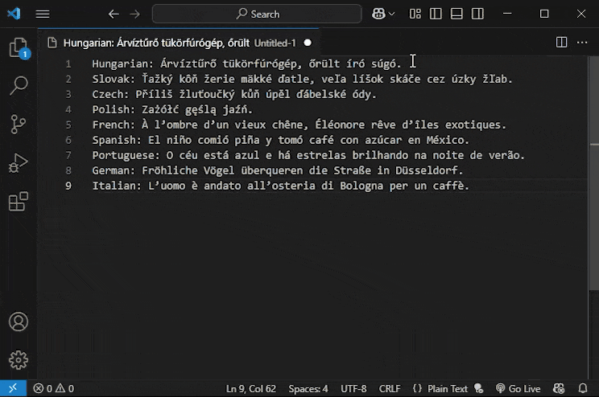

# Playful Sparkle: Replace Accents

**Playful Sparkle: Replace Accents** is your go-to Visual Studio Code extension for effortlessly removing accents from text. Utilizing Unicode normalization and customizable mappings, this tool ensures clean text processing for code, databases, and more. Quickly replace accented characters across your entire document, selections, or with multi-cursor.

---

## Features

* **Accent Replacement via Unicode Normalization**: The extension employs Unicode Normalization Form D (NFD) to decompose characters and subsequently removes combining diacritical marks. This method effectively replaces many accented characters (e.g., `á`, `é`, `ö`) with their unaccented equivalents (e.g., `a`, `e`, `o`).

* **Batch Processing**: Perform accent replacement across the entire active text document, within a selected text range, or across multiple selections using Visual Studio Code's multi-cursor feature.

* **Customizable Character Mapping**: Define specific character replacements using the custom mappings setting. These replacements are applied after the standard Unicode normalization and diacritic removal process, allowing for fine-grained control over how certain characters are handled. Ensure your custom mappings target the base characters (those remaining after diacritic removal).

* **Keyboard Shortcuts**: Quickly initiate the accent replacement process using the keyboard shortcut `Ctrl+Alt+R` on Windows and `Cmd+Alt+R` on macOS.

* **Multi-Language Support**: The extension's user interface and informational messages are available in English (en), Magyar (hu), Slovenčina (sk), Čeština (cs), Deutsch (de), Français (fr), Polski (pl), Български (bg), Español (es), Italiano (it), 日本語 (ja), 한국어 (ko), Português do Brasil (pt-br), Русский (ru), Türkçe (tr), 简体中文 (zh-cn), 繁體中文 (zh-tw) languages.

---

## Requirements

This extension has no special requirements or dependencies. It works directly within Visual Studio Code.

---
## Known Issues

* **Non-Latin Script Support**: The extension primarily relies on Unicode Normalization Form D (NFD) to decompose accented characters into base characters and combining diacritical marks. While this method effectively handles many accented characters in Latin-based scripts, its effectiveness with other script systems (e.g., Cyrillic, Greek, Arabic, CJK) may be limited. Characters in these scripts might not decompose in the same way, and therefore, the accent removal process might not yield the desired results. Users working with non-Latin scripts may need to rely more heavily on custom mappings, and even then, comprehensive support is not guaranteed.

* **Performance with Large Documents**: The extension processes the entire document content in memory after applying Unicode normalization. For very large documents, this in-memory processing, along with the subsequent iteration through each character, could lead to increased memory consumption and processing time. Users might experience a temporary slowdown or unresponsiveness in the Visual Studio Code editor, especially with files containing a very high character count.

* **Custom Mapping Considerations**: Custom mappings defined in the `psReplaceAccents.customMappings` setting are applied *after* the Unicode normalization and diacritic removal steps. This implies that custom mappings should generally target the base characters (those remaining after the diacritics are removed). Conflicts in custom mappings could arise if multiple mappings target the same base character, leading to the last defined mapping taking precedence. Additionally, if a custom mapping is intended to handle a character that the normalization process already modifies or removes, the custom mapping might not behave as expected. Users should carefully consider the interaction between Unicode normalization and their custom mappings.

If you encounter any of these or other issues, please report them on the [GitHub Issues page](https://github.com/playfulsparkle/vscode_ps_replace_accents/issues) with detailed steps to reproduce the problem.

---

## Release Notes

### 0.0.8

Translated Command Palette category

### 0.0.7

Add support for removing diacritics from file and folder names.

### 0.0.6

Introduced a streamlined issue reporting mechanism in alignment with **Microsoft Visual Studio Code** extension development best practices. This enhancement allows users to report bugs, suggest features, and provide feedback more efficiently, improving overall user experience and support responsiveness.

### 0.0.5

* **Enhanced Visuals:** The extension's icon color theme has been updated, providing a more polished and consistent look.
* **Improved User Understanding:** The extension description has been refined to be more clear, concise, and easier for new users to understand its features and benefits.

## 0.0.4

* Reverted to a more efficient method for diacritic removal using regular expressions. This simplifies the implementation compared to the previous character-by-character processing.

## 0.0.3

* Added additional languages: Čeština (cs), Deutsch (de), Français (fr), Polski (pl), Български (bg), Español (es), Italiano (it), 日本語 (ja), 한국어 (ko), Português do Brasil (pt-br), Русский (ru), Türkçe (tr), 简体中文 (zh-cn), 繁體中文 (zh-tw).

### 0.0.2

* Internal code refactoring to optimize document processing and selection mechanisms.
* Significant performance improvements in document processing achieved by switching to a line-by-line processing approach, leading to a reduced memory footprint.
* Updated success message behavior: The system now provides confirmation only when modifications have been made to the document.

### 0.0.1

* Initial public release of the **Playful Sparkle: Replace Accents** extension for Visual Studio Code.
* Implemented core text processing functionality leveraging Unicode Normalization Form D (NFD) for the replacement of accented characters with their unaccented counterparts. This includes handling a wide range of diacritical marks present in Latin-based scripts.
* Introduced support for user-defined custom character mappings via the `psReplaceAccents.customMappings` setting. This feature allows users to specify additional or override default replacement rules for specific characters, providing enhanced flexibility in text normalization.

---

## Support

For any inquiries, bug reports, or feature requests related to the **Playful Sparkle: Replace Accents** extension, please feel free to utilize the following channels:

* **GitHub Issues**: For bug reports, feature suggestions, or technical discussions, please open a new issue on the [GitHub repository](https://github.com/playfulsparkle/vscode_ps_replace_accents/issues). This allows for community visibility and tracking of reported issues.

* **Email Support**: For general questions or private inquiries, you can contact the developer directly via email at `support@playfulsparkle.com`. Please allow a reasonable timeframe for a response.

We encourage users to use the GitHub Issues page for bug reports and feature requests as it helps in better organization and tracking of the extension's development.

---

## License

This extension is licensed under the [BSD-3-Clause License](https://github.com/playfulsparkle/vscode_ps_replace_accents/blob/main/LICENSE). See the `LICENSE` file for complete details.

---

## Author

Hi! We're the team behind Playful Sparkle, a creative agency from Slovakia. We got started way back in 2004 and have been having fun building digital solutions ever since. Whether it's crafting a brand, designing a website, developing an app, or anything in between, we're all about delivering great results with a smile. We hope you enjoy using our Visual Studio Code extension!

---
